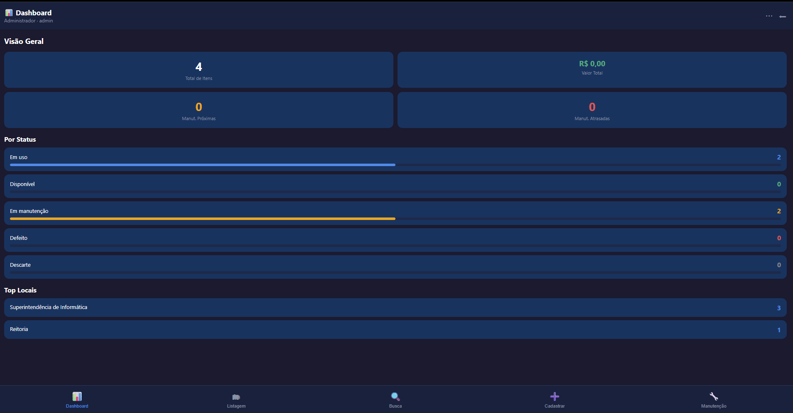
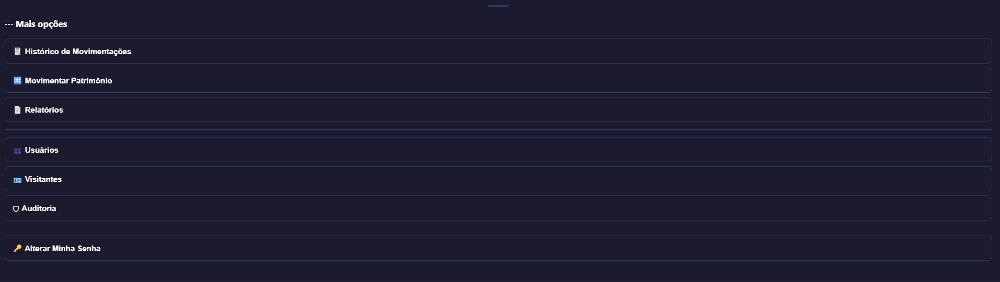

# 🏛️ Sistema Patrimonial UERGS

Sistema web para **gestão, controle e inventário de bens patrimoniais**, desenvolvido para centralizar o cadastro, acompanhamento, movimentação e consulta do patrimônio institucional.

O projeto evoluiu de uma aplicação desktop para uma arquitetura baseada em **API REST com FastAPI**, banco de dados **MariaDB** e interface web, com autenticação, controle de níveis de acesso, auditoria e ferramentas para importação de dados patrimoniais.

---

## 📌 Visão geral

O Sistema Patrimonial foi desenvolvido para facilitar o gerenciamento do patrimônio, permitindo acompanhar informações como:

* Código patrimonial
* Código patrimonial anterior
* Descrição do bem
* Número de série
* Data de aquisição
* Valor do patrimônio
* Situação
* Localização
* Responsável
* Histórico de movimentações
* Informações de inventário
* Manutenções
* Auditoria das ações realizadas

O sistema também permite importar patrimônios existentes a partir de planilhas Excel, facilitando a migração de dados para a aplicação.

---

## 🚀 Principais funcionalidades

### 📦 Gestão patrimonial

* Cadastro de patrimônios
* Consulta e pesquisa
* Edição de registros
* Controle de situação do patrimônio
* Número de série
* Valor de aquisição
* Data de aquisição
* Código patrimonial anterior
* Localização
* Responsável
* Observações

### 📊 Dashboard

Painel com informações gerais do acervo e indicadores do sistema, permitindo uma visão rápida da situação patrimonial.

### 🔎 Busca

Pesquisa de patrimônios utilizando diferentes informações, incluindo:

* Código patrimonial
* Descrição
* Número de série
* Responsável
* Localização

### 🔄 Movimentação

Registro e acompanhamento da movimentação dos patrimônios entre locais e responsáveis.

### 🔧 Manutenção

Controle de manutenções dos equipamentos, permitindo acompanhar:

* Manutenções programadas
* Situação da manutenção
* Datas
* Histórico

O sistema também possui alertas relacionados às manutenções próximas.

### 📋 Inventário

Recursos para auxiliar na realização do inventário patrimonial e conferência dos bens por localização.

### 📥 Importação de planilhas

Importação de patrimônios através de arquivos Excel (`.xlsx` / `.xlsm`).

Antes da confirmação, o sistema realiza uma etapa de **pré-visualização**, permitindo verificar os registros encontrados e identificar patrimônios novos ou já existentes.

A importação também evita a duplicação de patrimônios já cadastrados.

### 👥 Usuários e permissões

O sistema possui autenticação e diferentes níveis de acesso:

| Nível         | Visualizar | Cadastrar/Editar | Administração |
| ------------- | :--------: | :--------------: | :-----------: |
| Visualizador  |      ✅     |         ❌        |       ❌       |
| Editor        |      ✅     |         ✅        |       ❌       |
| Administrador |      ✅     |         ✅        |       ✅       |

### 📝 Auditoria

As ações realizadas no sistema podem ser registradas para fins de rastreabilidade, incluindo informações sobre:

* Usuário
* Ação realizada
* Registro afetado
* Data e horário
* Descrição da operação
* IP, quando disponível

### 📈 Relatórios

Geração de relatórios para facilitar a análise e acompanhamento dos patrimônios cadastrados.

---

## 🖥️ Interface

### Dashboard



### Administração



---

## 🏗️ Arquitetura

A versão atual utiliza uma arquitetura separada em camadas, com uma API responsável pelas regras de acesso aos dados e uma interface web para interação com o sistema.

```text
┌─────────────────────────────┐
│          Navegador          │
│        Interface Web        │
└──────────────┬──────────────┘
               │ HTTP
               ▼
┌─────────────────────────────┐
│        FastAPI / API        │
│                             │
│  Autenticação               │
│  Patrimônios                │
│  Usuários                   │
│  Visitantes                 │
│  Importação                 │
└──────────────┬──────────────┘
               │
               ▼
┌─────────────────────────────┐
│          MariaDB            │
│                             │
│  Patrimônio                 │
│  Usuários                   │
│  Auditoria                  │
│  Movimentações              │
│  Manutenções                │
└─────────────────────────────┘
```

---

## 🛠️ Tecnologias utilizadas

### Backend

* **Python**
* **FastAPI**
* **Uvicorn**
* **PyJWT**
* **OpenPyXL**

### Banco de dados

* **MariaDB**
* SQL

### Frontend

* HTML
* CSS
* JavaScript

### Infraestrutura

* Linux
* Systemd
* Nginx
* API REST

---

## 📁 Estrutura do projeto

```text
leitor-patrimonio/
│
├── api/
│   ├── routes/
│   │   ├── auth.py
│   │   ├── importacao.py
│   │   ├── outros.py
│   │   ├── patrimonios.py
│   │   ├── usuarios.py
│   │   └── visitantes.py
│   │
│   ├── app.py
│   ├── config.py
│   └── deps.py
│
├── core/
│   ├── auditoria.py
│   ├── auth.py
│   ├── dashboard.py
│   ├── inventario.py
│   ├── manutencao.py
│   ├── movimentacao.py
│   ├── patrimonio.py
│   ├── relatorios.py
│   └── visitantes.py
│
├── db/
│   ├── banco.py
│   ├── config.py
│   ├── migracao_usuarios_visitantes.sql
│   └── schema_atualizacao.sql
│
├── deploy/
│   ├── instalar.sh
│   ├── instalar_parte2.sh
│   ├── nginx-patrimonio.conf
│   ├── patrimonio-api.service
│   └── GUIA_INSTALACAO_SERVIDOR.md
│
├── docs/
│   └── screenshots/
│       ├── dashboard.png
│       └── menu-admin.png
│
├── gui/
│   └── main.py
│
├── web/
│   └── index.html
│
├── .gitignore
├── INICIAR_API.bat
└── README.md
```

---

## 🔐 Segurança e configuração

As configurações sensíveis não devem ser armazenadas diretamente no código-fonte.

O projeto utiliza variáveis de ambiente para informações como:

```text
DB_HOST
DB_USER
DB_PASSWORD
DB_NAME
DB_PORT
SECRET_KEY
```

Exemplo:

```env
DB_HOST=localhost
DB_USER=patrimonio_user
DB_PASSWORD=sua_senha
DB_NAME=patrimonio
DB_PORT=3306

SECRET_KEY=uma-chave-secreta-longa-e-aleatoria
```

> ⚠️ Nunca publique senhas, tokens, chaves secretas ou dados reais do banco no repositório.

---

## 💾 Banco de dados

O sistema utiliza **MariaDB**.

Para atualizar uma instalação existente, o projeto possui scripts SQL na pasta:

```text
db/
```

Por exemplo:

```bash
mysql -u root -p patrimonio < db/schema_atualizacao.sql
```

As migrações são projetadas para atualizar a estrutura existente sem apagar os dados patrimoniais já cadastrados.

---

## ⚙️ Instalação

Clone o repositório:

```bash
git clone https://github.com/lucasdevpint/leitor-patrimonio.git
cd leitor-patrimonio
```

Crie um ambiente virtual:

```bash
python3 -m venv venv
source venv/bin/activate
```

Instale as dependências:

```bash
pip install fastapi uvicorn pyjwt python-multipart openpyxl mysql-connector-python
```

Configure as variáveis de ambiente do banco e da aplicação.

Depois, execute as instruções disponíveis em:

```text
deploy/GUIA_INSTALACAO_SERVIDOR.md
```

---

## 🌐 Deploy

O projeto possui arquivos para implantação em servidor Linux:

```text
deploy/
├── instalar.sh
├── instalar_parte2.sh
├── nginx-patrimonio.conf
└── patrimonio-api.service
```

A API pode ser executada como um serviço do **systemd**, permitindo que o sistema seja iniciado automaticamente junto ao servidor.

---

## 📥 Importação patrimonial

Uma das funcionalidades desenvolvidas para facilitar a implantação do sistema foi a importação de patrimônios existentes.

O fluxo é:

```text
Planilha Excel
      │
      ▼
┌───────────────────┐
│ Upload da planilha│
└─────────┬─────────┘
          ▼
┌───────────────────┐
│ Validação         │
│ das colunas       │
└─────────┬─────────┘
          ▼
┌───────────────────┐
│ Pré-visualização  │
│ dos registros     │
└─────────┬─────────┘
          ▼
┌───────────────────┐
│ Identificação de  │
│ registros novos   │
└─────────┬─────────┘
          ▼
┌───────────────────┐
│ Confirmação       │
└─────────┬─────────┘
          ▼
┌───────────────────┐
│ MariaDB           │
└───────────────────┘
```

O sistema verifica os códigos patrimoniais existentes antes da inserção, evitando duplicidades.

---

## 📌 Status do projeto

**Versão:** 3.x

O projeto encontra-se em desenvolvimento contínuo, com a arquitetura atual voltada para utilização em servidor Linux e acesso através de interface web.

---

## 👨‍💻 Autor

**Lucas Fernandes Pinto**

Estudante de Engenharia de Computação.

Projeto desenvolvido como solução para gerenciamento e controle patrimonial institucional.

---

## 📄 Licença

Este projeto é disponibilizado neste repositório para fins de apresentação, documentação e portfólio.

Consulte o proprietário do projeto antes de reutilizar o código em ambientes institucionais ou comerciais.
